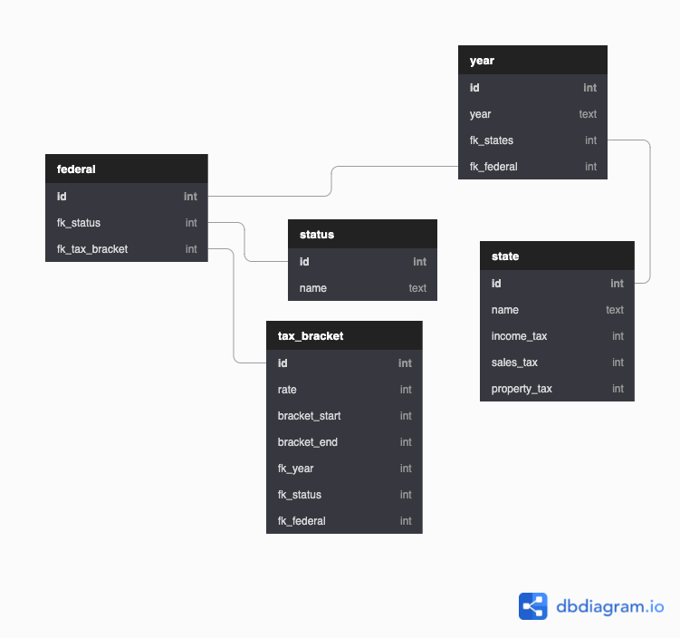

## USA TAX API

<!-- Technologies Used -->

### Getting Started

A RESTful API for United State's Taxes

[Click Here](https://usa-tax-api.herokuapp.com) to see the deployed application.

[Click Here](https://trello.com/invite/b/JWXNYbNF/c3de2d19eb5bb4791c3c8653239b6680/usa-tax-api) to see currently pending tasks

### Database Schema

### Endpoints

| Endpoint   | Description                    | Response Type   |
| ---------- | ------------------------------ | --------------- |
| /states/   | return a list of state objects | List[State]     |
| /state     |                                |                 |
| ---------- | ------------------------------ | --------------- |

### Example Responses

### Contributors

### Useful Websites

<!-- https://smartasset.com/taxes/income-taxes#tax-calculators -->

### Contributors

-   Chris Basham
-   Stephan Randle
-   Timmy Do
